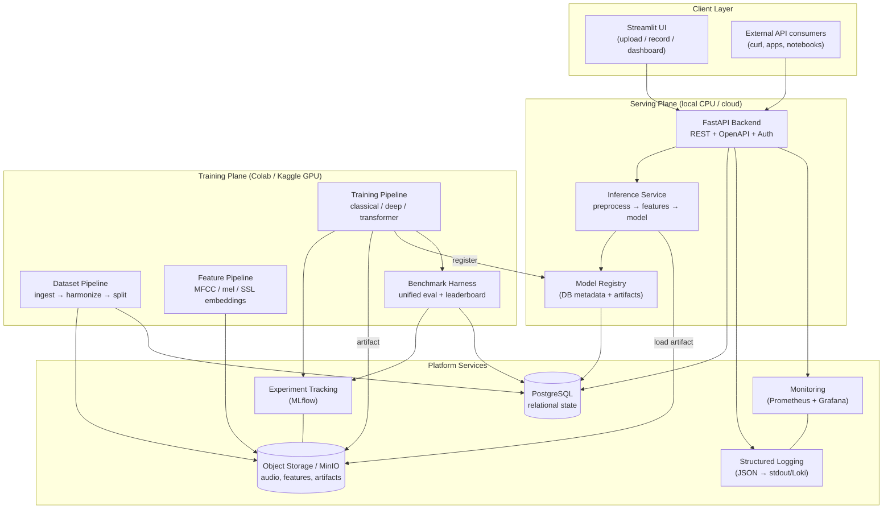
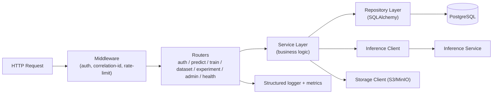
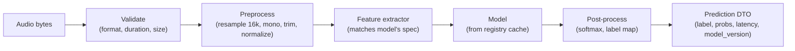
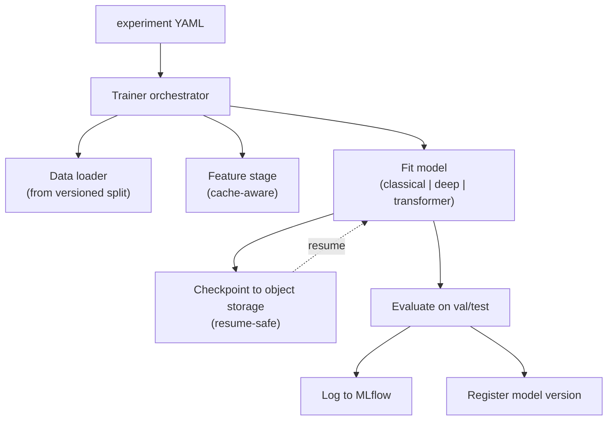
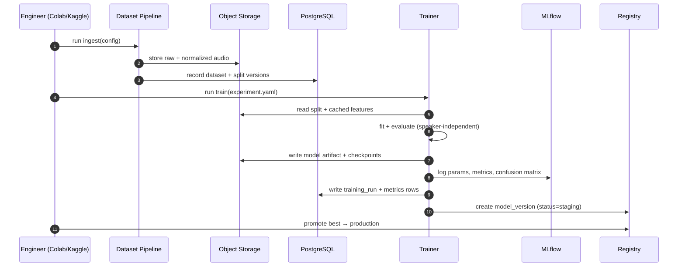
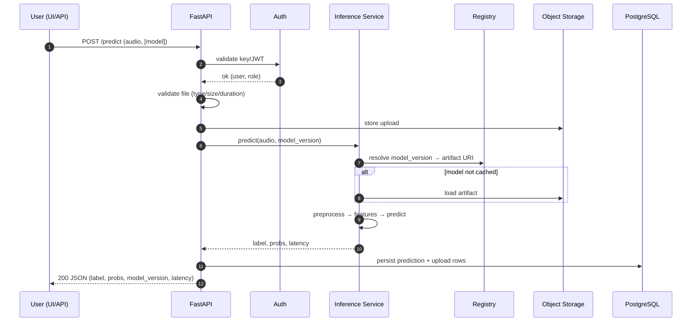

# Technical Design Document (TDD)

**Product:** EmotionSense AI — Production-Ready Speech Emotion Recognition Platform
**Version:** 2.0 (design)
**Date:** 2026-07-26
**Related:** [`01-PRD.md`](01-PRD.md), [`03-database-schema.md`](03-database-schema.md), [`04-api-specification.md`](04-api-specification.md)

---

## 1. Design Principles

1. **Config over code.** New datasets/models/experiments are declared in YAML, not
   coded ad hoc. Enables reproducibility (NFR-3) and researcher extensibility (US-5).
2. **Train/serve separation.** Training is a portable, GPU-bound pipeline (Colab/
   Kaggle). Serving is a lightweight, CPU-bound service (local/cloud). The **artifact
   contract** (a serialized model + metadata + preprocessing spec) is the only
   coupling between them.
3. **Registry as source of truth.** A model is servable only if it is in the registry
   with metadata, metrics, and an artifact URI. The API never loads a random file.
4. **Honest evaluation is a first-class subsystem**, not an afterthought — the
   benchmark harness is a core component, not a script.
5. **Twelve-factor-ish.** Config from env/files, stateless API, logs to stdout,
   backing services (DB, object store) attached by URL.

---

## 2. High-Level Architecture

**Reading it:** the **Training Plane** (top-heavy, GPU) produces artifacts + registry
entries + experiment records. The **Serving Plane** (lightweight, CPU) consumes the
registry to answer requests. **Platform Services** are shared backing services. The
two planes never call each other directly — they communicate only through the DB,
object storage, and the registry. This is what makes "train on Kaggle, serve locally"
work cleanly.

---

## 3. Low-Level Architecture (component internals)

### 3.1 Backend (FastAPI)

Layering: **router → service → repository**. Routers do I/O validation (Pydantic),
services hold business rules, repositories own persistence. The inference call is
abstracted behind an `InferenceClient` so serving can later move out-of-process
(separate container) without changing the API.

### 3.2 Inference Service

The **feature extractor is selected by the model's metadata**, guaranteeing
train/serve feature parity (a classic SER bug source). Models are lazy-loaded and
LRU-cached in memory keyed by `model_version_id`.

### 3.3 Training Pipeline (Colab/Kaggle)

Long transformer fine-tunes checkpoint every N steps to object storage so a killed
Kaggle session resumes (FR-M5, US-2). Classical/deep models are cheap enough to run
in one session.

---

## 4. Data Flow

### 4.1 Training/benchmark flow

### 4.2 Inference flow

---

## 5. Component Interaction Matrix

| Component | Talks to | Protocol | Purpose |
|-----------|----------|----------|---------|
| Streamlit UI | Backend API | HTTPS/REST | User actions |
| Backend API | Inference Service | in-proc call (v2.0) / HTTP (future) | Predictions |
| Backend API | PostgreSQL | SQL (SQLAlchemy) | State |
| Backend API | Object Storage | S3 API | Store uploads, load artifacts |
| Inference Service | Registry (DB) | SQL | Resolve model version → artifact |
| Training Pipeline | MLflow | MLflow client | Experiment logging |
| Training Pipeline | Object Storage | S3 API | Artifacts, checkpoints, features |
| Training Pipeline | Registry (DB) | SQL | Register model versions |
| Benchmark Harness | MLflow + DB | client + SQL | Leaderboard |
| Monitoring | API metrics endpoint | Prometheus scrape | Metrics |
| All services | Logging | JSON → stdout | Observability |

---

## 6. Technology Choices & Justification

| Concern | Choice | Why (justification) | Alternatives rejected |
|---------|--------|---------------------|-----------------------|
| Language | Python 3.11 | Ecosystem (librosa, torch, sklearn, transformers); one language across ML + backend | — |
| API framework | **FastAPI** | Async, Pydantic validation, auto OpenAPI (NFR-10), high perf | Flask (no async/auto-docs), Django (heavy) |
| UI | **Streamlit** | Fastest path to an audio upload/record demo; Python-native | React (more work, no ML payoff for a demo); Gradio (less layout control) |
| Classical ML | scikit-learn + XGBoost | Standard, fast on CPU, strong baselines | — |
| Deep learning | **PyTorch** | Dominant research framework; HF `transformers` integration | TensorFlow (weaker HF ecosystem) |
| Transformers | HF `transformers` + Distil-HuBERT primary | Distil-HuBERT ≈ HuBERT accuracy at fraction of cost → fits free GPU (research §2) | wav2vec2-large fine-tune (too heavy for free tier) |
| Audio | librosa + torchaudio + soundfile | librosa for features, torchaudio for SSL model I/O | — |
| Experiment tracking | **MLflow** | Open-source, self-hostable, model registry built-in, no account needed | W&B (great but SaaS/account; MLflow is more portable/offline) |
| Relational DB | **PostgreSQL** | Robust, JSONB for flexible metrics, strong ecosystem | SQLite (no concurrency for API); MySQL (weaker JSON) |
| ORM/migrations | SQLAlchemy 2.x + Alembic | Typed models + versioned migrations | raw SQL (unmaintainable) |
| Object storage | **MinIO** (S3-compatible) | Local S3 semantics; swap to real S3 in cloud with 0 code change | local FS (breaks portability/cloud story) |
| Auth | JWT (users) + API keys (services) | Standard; role separation (US-8) | OAuth provider (overkill for v2.0) |
| Monitoring | Prometheus + Grafana | Standard metrics stack; Grafana dashboards for the demo | hosted APM (cost/account) |
| Logging | structlog → JSON | Correlation IDs (NFR-6), machine-parseable | plain logging (unstructured) |
| Container | Docker + docker compose | One-command local stack (FR-P6) | bare venv (no service orchestration) |
| CI | GitHub Actions | Free for public repos; lint+test+build | — |
| Config | Pydantic Settings + YAML | Typed config, env overrides | argparse sprawl |
| Task/async training trigger | FastAPI BackgroundTasks (v2.0), Celery (stretch) | Avoid premature broker complexity | Celery+Redis now (over-engineering) |

---

## 7. Key Design Decisions & Trade-offs (ADR-style)

**ADR-1: In-process inference in v2.0, extractable later.**
*Decision:* the inference service is a Python module called in-process by the API,
behind an `InferenceClient` interface.
*Trade-off:* simpler ops now (one container) vs. independent scaling later. The
interface boundary means we can promote it to a separate microservice without
touching routers. *Chosen for:* free-tier simplicity (NFR-4).

**ADR-2: Registry backed by Postgres + object storage, not MLflow-only.**
*Decision:* MLflow tracks *experiments*; our own `model_versions` table is the
*serving* source of truth (status: staging/production/archived), pointing to artifact
URIs. *Trade-off:* slight duplication vs. clean separation of "research history" from
"what's live." *Chosen for:* the API must not depend on MLflow being up to serve.

**ADR-3: Feature spec travels with the model.**
*Decision:* each model version stores its preprocessing + feature config; inference
reads it. *Trade-off:* a little metadata overhead vs. eliminating train/serve skew —
the most common SER production bug. *Chosen for:* correctness.

**ADR-4: Speaker-independent splits enforced at the pipeline level.**
*Decision:* the split function groups by speaker; speaker-dependent splits are not
even an option in the default path. *Trade-off:* lower headline accuracy vs. honesty
and generalization. *Chosen for:* the project's core differentiator.

**ADR-5: Distil-HuBERT as the default transformer; heavy models opt-in.**
*Trade-off:* not chasing max accuracy vs. staying within free GPU + CPU-serving
latency (NFR-1). *Chosen for:* the compute constraint is a hard requirement.

**ADR-6: Monolithic monorepo, modular packages.**
*Decision:* one repo, clear package boundaries (`ml`, `training`, `inference`,
`backend`, `frontend`). *Trade-off:* not polyrepo microservices vs. simplicity and
demoability. *Chosen for:* a solo/portfolio project ships faster as a clean monolith.

**ADR-7: Synchronous training trigger via API is fire-and-forget only.**
Real training happens on Colab/Kaggle notebooks that call the same `training` package;
the API's `/train` endpoint enqueues/records intent and is primarily for small/local
runs. *Trade-off:* avoids running GPU jobs inside the API container (impossible on the
CPU host). *Chosen for:* honest about where compute lives.

---

## 8. Scalability & Extensibility Notes

- **Add a dataset:** implement a loader conforming to the dataset interface + a YAML
  entry; harmonization map handles labels. No changes elsewhere.
- **Add a model:** implement a trainer conforming to the model interface + a YAML
  entry; registry + harness pick it up automatically.
- **Scale serving:** the API is stateless → horizontal scale behind a load balancer;
  models cached per instance. Object storage + DB are the shared state.
- **Move to cloud:** swap MinIO→S3, local Postgres→RDS, compose→k8s; no app code change.

---

## 9. Security Design (baseline)

- Auth on all write/admin endpoints; read `/predict` may allow anonymous or API-key (config).
- Input validation: MIME + magic-byte check, max size, max duration; reject early (US-10).
- Secrets via env only; `.env` gitignored; example `.env.template` committed.
- Rate limiting middleware on `/predict` to prevent abuse.
- Audit log for all admin/model-lifecycle actions (US-9).
- Uploaded audio stored with random keys; not served back publicly by default.

---

## 10. Observability Design

- **Logs:** structured JSON with `correlation_id`, `user_id`, `model_version`, `latency_ms`.
- **Metrics (Prometheus):** request count/latency histograms, error counter, model
  load time, in-flight requests, per-class prediction counter (drift signal).
- **Dashboards (Grafana):** latency p50/p95, throughput, error rate, prediction
  distribution — doubles as demo material.
- **Tracing:** correlation ID propagated request→inference→DB for end-to-end debugging.
