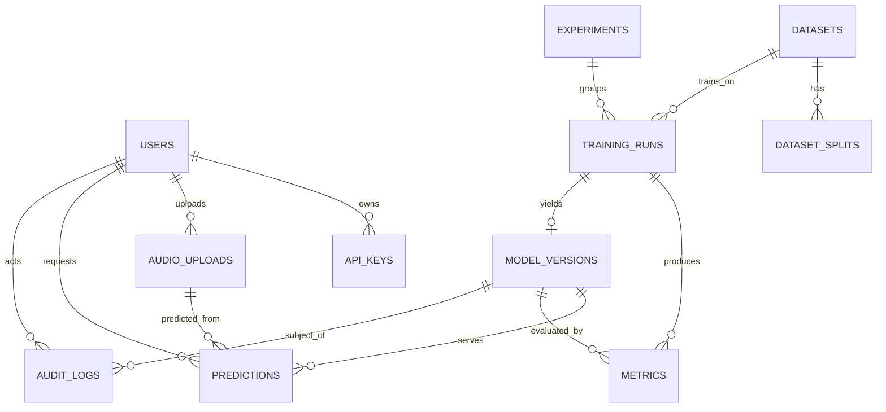

# Database Schema Design

**Product:** EmotionSense AI
**Version:** 2.0 (design)
**Engine:** PostgreSQL 15+ · SQLAlchemy 2.x models · Alembic migrations
**Date:** 2026-07-26
**Related:** [`02-TDD.md`](02-TDD.md), [`04-api-specification.md`](04-api-specification.md)

> This is **schema design**, not application code. DDL is the precise, unambiguous way
> to express a schema and is included deliberately. All tables use `uuid` primary keys
> (generated app-side or via `gen_random_uuid()`), `created_at`/`updated_at`
> timestamps (UTC), and soft-delete (`deleted_at`) where records must be auditable.

---

## 1. Entity-Relationship Overview



---

## 2. Enumerated Types

```sql
CREATE TYPE user_role         AS ENUM ('user', 'admin', 'service');
CREATE TYPE model_family       AS ENUM ('svm','random_forest','xgboost','cnn','lstm','bilstm',
                                        'distilhubert','hubert','wav2vec2','emotion2vec','ensemble');
CREATE TYPE model_status       AS ENUM ('staging','production','archived','failed');
CREATE TYPE training_status    AS ENUM ('queued','running','completed','failed','cancelled');
CREATE TYPE eval_kind          AS ENUM ('validation','test','cross_corpus');
CREATE TYPE split_type         AS ENUM ('train','val','test');
CREATE TYPE audit_action       AS ENUM ('create','update','delete','promote','retire','login','predict');
```

---

## 3. Tables

### 3.1 `users`
Registered users and service accounts. Auth subjects.

```sql
CREATE TABLE users (
    id             UUID PRIMARY KEY DEFAULT gen_random_uuid(),
    email          CITEXT UNIQUE NOT NULL,
    hashed_password TEXT NOT NULL,               -- bcrypt/argon2; never plaintext
    full_name      TEXT,
    role           user_role NOT NULL DEFAULT 'user',
    is_active      BOOLEAN NOT NULL DEFAULT TRUE,
    created_at     TIMESTAMPTZ NOT NULL DEFAULT now(),
    updated_at     TIMESTAMPTZ NOT NULL DEFAULT now(),
    deleted_at     TIMESTAMPTZ
);
CREATE INDEX idx_users_role ON users(role) WHERE deleted_at IS NULL;
```

### 3.2 `api_keys`
Service/API-key auth (US-7, Sam integrating). Key stored hashed.

```sql
CREATE TABLE api_keys (
    id           UUID PRIMARY KEY DEFAULT gen_random_uuid(),
    user_id      UUID NOT NULL REFERENCES users(id) ON DELETE CASCADE,
    name         TEXT NOT NULL,
    key_hash     TEXT NOT NULL,                  -- SHA-256 of the token; prefix shown to user
    key_prefix   TEXT NOT NULL,                  -- first 8 chars for identification
    scopes       TEXT[] NOT NULL DEFAULT '{}',   -- e.g. {'predict:read'}
    last_used_at TIMESTAMPTZ,
    expires_at   TIMESTAMPTZ,
    revoked      BOOLEAN NOT NULL DEFAULT FALSE,
    created_at   TIMESTAMPTZ NOT NULL DEFAULT now()
);
CREATE UNIQUE INDEX idx_api_keys_hash ON api_keys(key_hash);
CREATE INDEX idx_api_keys_user ON api_keys(user_id);
```

### 3.3 `datasets`
Registered corpora (RAVDESS, TESS, SAVEE, CREMA-D, AESDD, IEMOCAP).

```sql
CREATE TABLE datasets (
    id            UUID PRIMARY KEY DEFAULT gen_random_uuid(),
    name          TEXT UNIQUE NOT NULL,          -- 'ravdess'
    display_name  TEXT NOT NULL,                 -- 'RAVDESS'
    language      TEXT NOT NULL DEFAULT 'en',
    license       TEXT,                          -- 'CC BY-NC-SA 4.0' / 'gated'
    source_url    TEXT,
    num_samples   INTEGER,
    num_speakers  INTEGER,
    label_map     JSONB NOT NULL,                -- native label -> harmonized label
    version       TEXT NOT NULL DEFAULT 'v1',    -- data version (reproducibility)
    checksum      TEXT,                          -- integrity of the normalized set
    created_at    TIMESTAMPTZ NOT NULL DEFAULT now(),
    UNIQUE (name, version)
);
```

### 3.4 `dataset_splits`
Persisted, versioned, **speaker-independent** splits (ADR-4, FR-D3). One row per
sample-in-split (or store the manifest URI — see note).

```sql
CREATE TABLE dataset_splits (
    id           UUID PRIMARY KEY DEFAULT gen_random_uuid(),
    dataset_id   UUID NOT NULL REFERENCES datasets(id) ON DELETE CASCADE,
    split        split_type NOT NULL,
    split_version TEXT NOT NULL,                 -- 'si-fold0' speaker-independent fold 0
    manifest_uri TEXT NOT NULL,                  -- object-storage path to file list + labels
    num_samples  INTEGER NOT NULL,
    seed         INTEGER NOT NULL,               -- reproducibility
    created_at   TIMESTAMPTZ NOT NULL DEFAULT now(),
    UNIQUE (dataset_id, split, split_version)
);
```
> **Note:** per-sample rows would bloat the DB (100k+ rows). We store the split as a
> **manifest file** in object storage and keep only the pointer + metadata here.
> Reproducibility comes from `seed` + `split_version` + dataset `checksum`.

### 3.5 `experiments`
Logical grouping of training runs (an experiment = one research question).

```sql
CREATE TABLE experiments (
    id           UUID PRIMARY KEY DEFAULT gen_random_uuid(),
    name         TEXT NOT NULL,                  -- 'baseline-classical-ravdess'
    description  TEXT,
    mlflow_experiment_id TEXT,                   -- link to MLflow
    config       JSONB NOT NULL,                 -- the experiment YAML, snapshotted
    created_by   UUID REFERENCES users(id),
    created_at   TIMESTAMPTZ NOT NULL DEFAULT now(),
    UNIQUE (name)
);
```

### 3.6 `training_runs`
A single fit of one model on one dataset/split under one config.

```sql
CREATE TABLE training_runs (
    id            UUID PRIMARY KEY DEFAULT gen_random_uuid(),
    experiment_id UUID NOT NULL REFERENCES experiments(id) ON DELETE CASCADE,
    dataset_id    UUID NOT NULL REFERENCES datasets(id),
    split_version TEXT NOT NULL,
    model_family  model_family NOT NULL,
    status        training_status NOT NULL DEFAULT 'queued',
    config        JSONB NOT NULL,                -- hyperparams, feature spec, seed
    mlflow_run_id TEXT,                          -- link to MLflow run
    environment   TEXT,                          -- 'kaggle-gpu-p100' / 'colab-t4' / 'local-cpu'
    checkpoint_uri TEXT,                         -- resume point (FR-M5)
    started_at    TIMESTAMPTZ,
    finished_at   TIMESTAMPTZ,
    error_message TEXT,
    created_by    UUID REFERENCES users(id),
    created_at    TIMESTAMPTZ NOT NULL DEFAULT now()
);
CREATE INDEX idx_runs_experiment ON training_runs(experiment_id);
CREATE INDEX idx_runs_status ON training_runs(status);
```

### 3.7 `model_versions`
The **serving source of truth** (ADR-2). Produced by a training run.

```sql
CREATE TABLE model_versions (
    id             UUID PRIMARY KEY DEFAULT gen_random_uuid(),
    training_run_id UUID REFERENCES training_runs(id) ON DELETE SET NULL,
    model_family   model_family NOT NULL,
    name           TEXT NOT NULL,                -- 'distilhubert-ravdess'
    version        TEXT NOT NULL,                -- 'v3' / semver
    status         model_status NOT NULL DEFAULT 'staging',
    artifact_uri   TEXT NOT NULL,                -- object-storage path to serialized model
    feature_spec   JSONB NOT NULL,               -- preprocessing+feature config (ADR-3)
    label_classes  TEXT[] NOT NULL,              -- ordered class labels
    framework      TEXT NOT NULL,                -- 'sklearn' / 'pytorch' / 'transformers'
    size_bytes     BIGINT,
    headline_metric NUMERIC(6,4),                -- e.g. test macro-F1 for quick sort
    is_default     BOOLEAN NOT NULL DEFAULT FALSE,
    created_at     TIMESTAMPTZ NOT NULL DEFAULT now(),
    promoted_at    TIMESTAMPTZ,
    UNIQUE (name, version)
);
-- exactly one production default per model name, enforced app-side + partial index
CREATE UNIQUE INDEX idx_one_default
    ON model_versions(name) WHERE is_default AND status = 'production';
CREATE INDEX idx_mv_status ON model_versions(status);
```

### 3.8 `metrics`
Evaluation results — attached to a training run and/or model version. Flexible via
`metric_name`/`metric_value`, with structured artifacts (confusion matrix) in JSONB.

```sql
CREATE TABLE metrics (
    id              UUID PRIMARY KEY DEFAULT gen_random_uuid(),
    training_run_id UUID REFERENCES training_runs(id) ON DELETE CASCADE,
    model_version_id UUID REFERENCES model_versions(id) ON DELETE CASCADE,
    eval_kind       eval_kind NOT NULL,          -- validation | test | cross_corpus
    eval_dataset_id UUID REFERENCES datasets(id),-- for cross_corpus: the held-out corpus
    metric_name     TEXT NOT NULL,               -- 'accuracy','wa','ua','macro_f1','roc_auc'
    metric_value    NUMERIC(8,5) NOT NULL,
    per_class       JSONB,                       -- {label: {precision,recall,f1}}
    confusion_matrix JSONB,                      -- nested array
    created_at      TIMESTAMPTZ NOT NULL DEFAULT now(),
    CHECK (training_run_id IS NOT NULL OR model_version_id IS NOT NULL)
);
CREATE INDEX idx_metrics_mv ON metrics(model_version_id);
CREATE INDEX idx_metrics_run ON metrics(training_run_id);
CREATE INDEX idx_metrics_name ON metrics(metric_name);
```

### 3.9 `audio_uploads`
User-submitted audio for prediction (FR-P2). File in object storage; metadata here.

```sql
CREATE TABLE audio_uploads (
    id            UUID PRIMARY KEY DEFAULT gen_random_uuid(),
    user_id       UUID REFERENCES users(id) ON DELETE SET NULL,
    object_uri    TEXT NOT NULL,                 -- storage key (random)
    original_name TEXT,
    mime_type     TEXT NOT NULL,
    size_bytes    BIGINT NOT NULL,
    duration_sec  NUMERIC(8,3),
    sample_rate   INTEGER,
    checksum      TEXT,                          -- dedupe / integrity
    created_at    TIMESTAMPTZ NOT NULL DEFAULT now(),
    deleted_at    TIMESTAMPTZ
);
CREATE INDEX idx_uploads_user ON audio_uploads(user_id);
```

### 3.10 `predictions`
One inference result (US-3, US-6). Links upload + model version.

```sql
CREATE TABLE predictions (
    id               UUID PRIMARY KEY DEFAULT gen_random_uuid(),
    audio_upload_id  UUID NOT NULL REFERENCES audio_uploads(id) ON DELETE CASCADE,
    model_version_id UUID NOT NULL REFERENCES model_versions(id),
    user_id          UUID REFERENCES users(id) ON DELETE SET NULL,
    predicted_label  TEXT NOT NULL,
    confidence       NUMERIC(6,5) NOT NULL,      -- top-1 probability
    probabilities    JSONB NOT NULL,             -- {label: prob} full distribution
    latency_ms       INTEGER NOT NULL,
    correlation_id   TEXT,                        -- ties to logs (NFR-6)
    created_at       TIMESTAMPTZ NOT NULL DEFAULT now()
);
CREATE INDEX idx_pred_model ON predictions(model_version_id);
CREATE INDEX idx_pred_created ON predictions(created_at);   -- drift/monitoring queries
CREATE INDEX idx_pred_label ON predictions(predicted_label);
```

### 3.11 `audit_logs`
Accountability trail for admin/lifecycle actions (US-9, FR-P5).

```sql
CREATE TABLE audit_logs (
    id           UUID PRIMARY KEY DEFAULT gen_random_uuid(),
    actor_id     UUID REFERENCES users(id) ON DELETE SET NULL,
    action       audit_action NOT NULL,
    entity_type  TEXT NOT NULL,                  -- 'model_version','user','dataset'
    entity_id    UUID,
    before       JSONB,                          -- state snapshot pre-change
    after        JSONB,                          -- state snapshot post-change
    ip_address   INET,
    correlation_id TEXT,
    created_at   TIMESTAMPTZ NOT NULL DEFAULT now()
);
CREATE INDEX idx_audit_actor ON audit_logs(actor_id);
CREATE INDEX idx_audit_entity ON audit_logs(entity_type, entity_id);
CREATE INDEX idx_audit_created ON audit_logs(created_at);
```

---

## 4. Design Rationale & Trade-offs

| Decision | Rationale |
|----------|-----------|
| UUID PKs | Safe to generate on Colab/Kaggle offline and merge; no sequence coupling |
| Splits as manifest URI, not per-sample rows | 100k+ samples would bloat DB; object storage + seed gives reproducibility (§3.4 note) |
| `metrics` as tall table + JSONB artifacts | New metric types need no migration; confusion matrix stored structured |
| Separate `model_versions` from MLflow | API serves without MLflow uptime (ADR-2); `is_default` partial index guarantees one prod model per name |
| `feature_spec` on the model version | Eliminates train/serve skew (ADR-3) |
| `cross_corpus` as an `eval_kind` with `eval_dataset_id` | First-class support for the core differentiator (FR-E3) |
| Soft delete (`deleted_at`) on users/uploads | Auditability; hard-delete is admin-only and logged |
| `audit_logs.before/after` JSONB | Full change history without per-entity audit tables |

---

## 5. Retention & Housekeeping (design notes)

- **Uploads:** raw audio retained N days (config), then soft-deleted; object purged by
  a scheduled job. Prediction rows retained for monitoring/drift.
- **Predictions:** kept indefinitely (small rows) for drift analysis; partition by
  month if volume grows (future).
- **Checkpoints:** transient; pruned after a run completes and its artifact is registered.
- **Migrations:** all schema changes via Alembic; no manual DDL in production.
