# Phased Implementation Roadmap

**Product:** EmotionSense AI
**Version:** 2.0 (design)
**Date:** 2026-07-26
**Related:** [`01-PRD.md`](01-PRD.md), [`08-design-review.md`](08-design-review.md)

> Each phase is **independently testable** and leaves `main` green and demoable. Phases
> are ordered so that the project is *presentable* as early as possible (a thin
> end-to-end slice before breadth). Effort is in **ideal engineering days** for one
> developer; "×GPU" flags phases needing Colab/Kaggle sessions.
>
> **Core** = required for the v2.0 acceptance criteria (PRD §8). **Stretch** = added
> only after all Core phases are green.

---

## Dependency Graph

```mermaid
flowchart LR
    P0["P0 Setup"] --> P1["P1 Data Pipeline"]
    P1 --> P2["P2 Features + Classical"]
    P2 --> P3["P3 Benchmark Harness"]
    P2 --> P4["P4 Deep Models"]
    P4 --> P5["P5 Transformer Models ×GPU"]
    P3 --> P6["P6 Registry + Inference"]
    P5 --> P6
    P6 --> P7["P7 FastAPI Backend"]
    P7 --> P8["P8 Streamlit UI"]
    P7 --> P9["P9 Experiment Tracking + DB wiring"]
    P8 --> P10["P10 Docker Compose Stack"]
    P9 --> P10
    P10 --> P11["P11 CI/CD + Tests hardening"]
    P11 --> P12["P12 Monitoring + Logging"]
    P12 --> P13["P13 Docs + Model Cards + Demo"]
    P13 --> S["Stretch phases"]
```

---

## Core Phases

### P0 — Project Setup & Scaffolding
- **Goal:** an installable, linted, testable empty monorepo with the agreed structure.
- **Deliverables:** repo skeleton ([`05-folder-structure.md`](05-folder-structure.md)), `pyproject.toml`
  (ruff/black/mypy/pytest), pre-commit hooks, `.env.template`, `Makefile`, empty
  package `__init__`s, `common/` (config, logging, errors skeleton), CI stub.
- **Acceptance:** `make lint test` passes on an empty project; `pip install -e .` works;
  pre-commit blocks a planted secret.
- **Dependencies:** none.
- **Effort:** 1.5 d.

### P1 — Dataset Pipeline
- **Goal:** ingest + harmonize + speaker-independent split for ≥3 corpora.
- **Deliverables:** `datasets/` loaders (RAVDESS, TESS, SAVEE), harmonizer to canonical
  labels, **speaker-independent** split builder + manifests, augmentation module,
  `scripts/download_datasets.py`, `scripts/build_splits.py`.
- **Acceptance:** unified manifest produced; a test asserts **no speaker appears in two
  splits**; label distribution reported; re-running with same seed is byte-identical.
- **Dependencies:** P0.
- **Effort:** 3 d.

### P2 — Feature Extraction + Classical Models
- **Goal:** first models with real numbers.
- **Deliverables:** `ml/features/` (MFCC, mel, chroma) with caching; `ml/models/classical.py`
  (SVM, RandomForest, XGBoost); `ml/preprocess.py`; `training/trainer.py` (classical
  path); `training/evaluate.py` (acc, WA, UA, macro-F1, confusion matrix).
- **Acceptance:** all three classical models train from a YAML config and report metrics
  on the RAVDESS test split; feature cache hit verified; parity golden-test scaffolded.
- **Dependencies:** P1.
- **Effort:** 3 d.

### P3 — Benchmark Harness (the differentiator)
- **Goal:** one command → a fair leaderboard.
- **Deliverables:** `training/benchmark.py` running every configured model under
  identical splits/metrics; **cross-corpus** eval (train RAVDESS+TESS, test CREMA-D);
  `scripts/run_benchmark.py`; leaderboard export to `experiments/reports/`.
- **Acceptance:** leaderboard table generated with ≥3 models incl. one cross-corpus row;
  numbers reproducible from configs+seed (±1%); confusion matrices saved.
- **Dependencies:** P2.
- **Effort:** 2 d.

### P4 — Deep Models (CNN / LSTM / BiLSTM)
- **Goal:** add the deep-learning track.
- **Deliverables:** `ml/models/deep.py` (PyTorch CNN, LSTM, BiLSTM), training loop with
  checkpointing/early-stopping in `training/callbacks.py`; configs.
- **Acceptance:** all three train from config (CPU-ok for small, GPU for speed) and
  appear on the leaderboard; checkpoint resume verified.
- **Dependencies:** P2 (parallelizable with P3).
- **Effort:** 3 d.

### P5 — Transformer Models ×GPU (Colab/Kaggle)
- **Goal:** the credibility centerpiece — SSL models.
- **Deliverables:** `ml/features/ssl.py` (HuBERT/wav2vec2/emotion2vec embeddings);
  `ml/models/transformer.py` (frozen-embedding + head; Distil-HuBERT fine-tune);
  Kaggle notebook `03_train_transformer_kaggle.ipynb` with **checkpoint/resume** to
  object storage.
- **Acceptance:** Distil-HuBERT reaches the RAVDESS speaker-independent target (≥83%,
  PRD §8); a killed session resumes from checkpoint; models land on the leaderboard
  with a cross-corpus row.
- **Dependencies:** P4.
- **Effort:** 4 d (+ GPU session time).

### P6 — Model Registry + Inference Service
- **Goal:** turn trained artifacts into servable models.
- **Deliverables:** `registry/` (register/resolve/promote/retire; artifact (de)serialize
  to object storage with `feature_spec`); `inference/service.py` + `model_cache.py` +
  `validators.py`; `scripts/promote_model.py`.
- **Acceptance:** a registered model is loaded and predicts on a sample clip; **feature
  parity golden-test passes** (serve == train features); unloadable model raises
  `ModelUnavailableError`.
- **Dependencies:** P3, P5.
- **Effort:** 3 d.

### P7 — FastAPI Backend
- **Goal:** the API surface.
- **Deliverables:** `backend/` app (router→service→repository), auth (JWT + API keys,
  RBAC), middleware (correlation-id, rate-limit, metrics), routers for auth/predict/
  datasets/training/experiments/models/admin/health per [`04-api-specification.md`](04-api-specification.md);
  Alembic migrations for [`03-database-schema.md`](03-database-schema.md).
- **Acceptance:** OpenAPI served; `/predict` returns the documented JSON; auth enforced;
  promote is atomic; integration tests green against a test DB.
- **Dependencies:** P6.
- **Effort:** 5 d.

### P8 — Streamlit UI
- **Goal:** the demo face.
- **Deliverables:** `frontend/` — Predict page (upload/record → label + probability
  chart + waveform + spectrogram), Leaderboard page, typed `api_client.py`.
- **Acceptance:** a first-time user gets a prediction in < 90s (PRD success metric);
  leaderboard renders from the API.
- **Dependencies:** P7.
- **Effort:** 3 d.

### P9 — Experiment Tracking + DB Wiring
- **Goal:** reproducibility + persistence complete.
- **Deliverables:** MLflow integration (`training/mlflow_logger.py`); training runs write
  `training_runs`/`metrics`/`model_versions`; experiment/leaderboard endpoints read
  real data.
- **Acceptance:** every benchmark model has an MLflow run + registry entry + metrics
  rows; `/experiments/{id}/leaderboard` returns live data.
- **Dependencies:** P7 (overlaps P3/P6 for the writing side).
- **Effort:** 2 d.

### P10 — Docker Compose Stack
- **Goal:** one-command full stack (FR-P6).
- **Deliverables:** Dockerfiles (backend, frontend), `docker-compose.yml` with postgres,
  minio, mlflow, prometheus, grafana; entrypoints run migrations then serve.
- **Acceptance:** `docker compose up` yields a working predict flow + reachable MLflow +
  Grafana; `/health/ready` green.
- **Dependencies:** P8, P9.
- **Effort:** 2.5 d.

### P11 — CI/CD + Test Hardening
- **Goal:** enforce quality automatically.
- **Deliverables:** GitHub Actions (lint, type, unit+integration, image build; e2e on
  main); coverage gate ≥80% on core; contract + parity tests fleshed out.
- **Acceptance:** CI green and blocking; coverage gate enforced; a deliberately broken
  PR is rejected by CI.
- **Dependencies:** P10.
- **Effort:** 2 d.

### P12 — Monitoring + Logging
- **Goal:** observability (NFR-6, FR-P4).
- **Deliverables:** structlog JSON everywhere; Prometheus metrics (latency, throughput,
  errors, per-class prediction counter); Grafana dashboards provisioned.
- **Acceptance:** dashboards show live latency/throughput/prediction distribution during
  a load of sample requests; every request traceable by `correlation_id`.
- **Dependencies:** P11.
- **Effort:** 2 d.

### P13 — Docs, Model Cards & Live Demo
- **Goal:** portfolio finish.
- **Deliverables:** README (quickstart + architecture + demo link), rendered diagrams,
  per-model model cards, exported OpenAPI + usage guide, demo video, deployed public
  demo (Render/Railway/HF Spaces for UI; API where feasible).
- **Acceptance:** a stranger can clone, `docker compose up`, and reproduce the
  leaderboard from the README alone; live demo URL works.
- **Dependencies:** P12.
- **Effort:** 2.5 d.

**Core total: ~40 ideal engineering days** (calendar longer due to GPU session waits
and review). Milestone: an **end-to-end demoable slice** exists after **P7+P8** (even
before monitoring/CI), de-risking the "never ships" scope risk (PRD §11).

---

## Stretch Phases (only after Core is green)

| Phase | Goal | Deliverables | Acceptance | Depends | Effort |
|-------|------|--------------|------------|---------|--------|
| S1 Ensembles | Squeeze accuracy | Stacking/blend classical+transformer | Leaderboard shows ensemble ≥ best single | P5,P6 | 2 d |
| S2 Dimensional emotion | 2nd output mode | arousal/valence/dominance regression head | API returns dimensional scores | P6,P7 | 3 d |
| S3 Real-time mic | Live UX | Streamlit mic streaming → live predict | <1s round-trip in UI | P8 | 2 d |
| S4 IEMOCAP + multimodal | Research depth | IEMOCAP loader (post-licence), audio+text (Whisper) | 4-class IEMOCAP + MELD rows on leaderboard | P1,P5 | 4 d |
| S5 Noise-robustness suite | Trust | augmentation-based robustness benchmark | robustness curve reported | P3 | 2 d |
| S6 Explainability | Transparency | attention/saliency over spectrogram in UI | UI overlays saliency for a prediction | P8 | 3 d |
| S7 Cloud deploy + autoscale | Ops depth | k8s/managed deploy, S3/RDS swap | public autoscaled API | P10 | 3 d |
| S8 Celery async training | Scale training triggers | broker + workers for `/train` | queued run executes async | P7 | 2 d |

---

## Sequencing Notes & Risk Controls

- **Vertical slice first:** P0→P2→P6(min)→P7(predict-only)→P8 could produce a
  "predict one model in a UI" demo very early; the roadmap keeps that option open by
  making P6's minimum just "serve one classical model."
- **GPU-bound work (P5) is isolated** so free-tier session limits never block CPU work;
  P3/P4 proceed in parallel.
- **Stretch is genuinely optional** — each Core phase leaves a shippable product, so the
  project can be "declared done" at P13 regardless of stretch progress.
- **Cut lines if time-boxed:** drop to 3 datasets (RAVDESS/TESS/CREMA-D), 6 models
  (SVM/RF/XGBoost/BiLSTM/frozen-emotion2vec/Distil-HuBERT), and skip S* — still meets
  every PRD §8 acceptance criterion.
